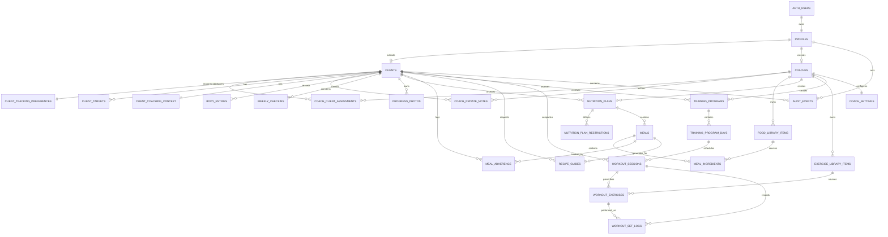
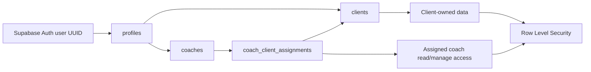

# XForm Coaching OS — Supabase ER diagram

Source migration: [`../supabase/migrations/202608200001_initial_coaching_os.sql`](../supabase/migrations/202608200001_initial_coaching_os.sql).

The application keeps identity in Supabase Auth and attaches all application data to the same UUID. `profiles` is the common workspace record; `clients` and `coaches` are role-specific extensions.

## Identity and access path

`auth.users.id = profiles.id = clients.id` for a client. This is why FastAPI can use the verified Supabase JWT `sub` directly as the current client identifier. A coach gains access to a client only through an active `coach_client_assignments` row.

## UI/API mapping

- Dashboard and Body Tracker: `clients`, `client_targets`, `body_entries`, `weekly_checkins`, `workout_sessions`, and `workout_set_logs`.
- Check-ins and Health Summary: `weekly_checkins`, `clients`, `client_coaching_context`. Private note content is intentionally not returned to the client.
- Progress Photos: `progress_photos` metadata plus the private `progress-photos` Storage bucket. Database paths are always `<client-uuid>/<object-name>`.
- Nutrition: `nutrition_plans`, `nutrition_plan_restrictions`, `meals`, `meal_ingredients`, `meal_adherence`, and `recipe_guides`.
- Workout: `training_programs`, `training_program_days`, `workout_sessions`, `workout_exercises`, and `workout_set_logs`.
- Coach UI: assignment roster, food/exercise libraries, settings, coach notes, plan versions (`version` plus `replaces_*_id`), and `audit_events`.

## Relationship decisions

- Client and coach IDs are UUIDs from Supabase Auth; `clients.client_code` is only the human-facing `XP-0001` style identifier shown in coach UI.
- Plan and programme versions are immutable-by-convention rows: publish a successor with `replaces_plan_id` / `replaces_program_id`, archive the former row, and retain historical logs against their original version.
- Meal ingredients and workout sets are individual rows, not JSON blobs. This keeps reporting, validation, and later exports practical.
- One active coach per client is enforced by a partial unique index. A reassignment closes the earlier record with `ended_at`; no historical context is lost.
- `progress_photos` stores no image data. The actual private files live in Supabase Storage, with matching Storage RLS policies.
